# Laporan Praktikum Basis Data - Pertemuan 01
**Nama:** Hamid Indra Nugroho   **NIM:** 25430029   **Kelas:** B   **Tanggal:** 4 Oktober 2026

Dosen pengampu: Bapak Dedi Irawan, S.Kom., M.T.I.

## 1. Tujuan Praktikum

Di pertemuan ini saya belajar menyiapkan tempat kerja untuk basis data:

1. menyalakan MariaDB lewat XAMPP dan membaca status serta port-nya;
2. masuk ke server lewat CLI dan phpMyAdmin, lalu membedakan keduanya;
3. memberi password pada root dan membuat akun kerja yang hanya boleh memakai satu basis data;
4. membuat basis data pertama dan mencatat pekerjaan ke Git lalu GitHub.

## 2. Ringkasan Dasar Teori

MariaDB memakai pola klien-server. Server (proses `mysqld`) menunggu di port 3306, sedangkan klien seperti `mysql` di Command Prompt atau phpMyAdmin hanya mengirim perintah SQL dan menampilkan jawabannya. Karena itu galat seperti 1044, 1045, dan 1142 berarti koneksi sudah sampai ke server dan server sendiri yang menolak permintaan kita. Kalau koneksinya sendiri gagal (misalnya kode 2002), berarti server belum menyala.

XAMPP menyatukan Apache, MariaDB, PHP, dan phpMyAdmin supaya mudah dinyalakan dari satu Control Panel. Versi yang dipakai (MariaDB 10.4.32) sudah tidak mendapat pembaruan keamanan, jadi cukup untuk belajar saja.

Di MariaDB sebuah akun ditentukan oleh pasangan `pengguna@host`, jadi `root@localhost` dan `root@127.0.0.1` dihitung sebagai dua akun berbeda. Akun root dipakai untuk administrasi saja, sedangkan pekerjaan sehari-hari memakai akun yang haknya dibatasi (prinsip hak akses minimum). Git dipakai untuk mencatat setiap perubahan berkas sebagai commit, dan GitHub menyimpan salinannya di internet.

## 3. Hasil Langkah Percobaan

### D.1 Menjalankan layanan MariaDB

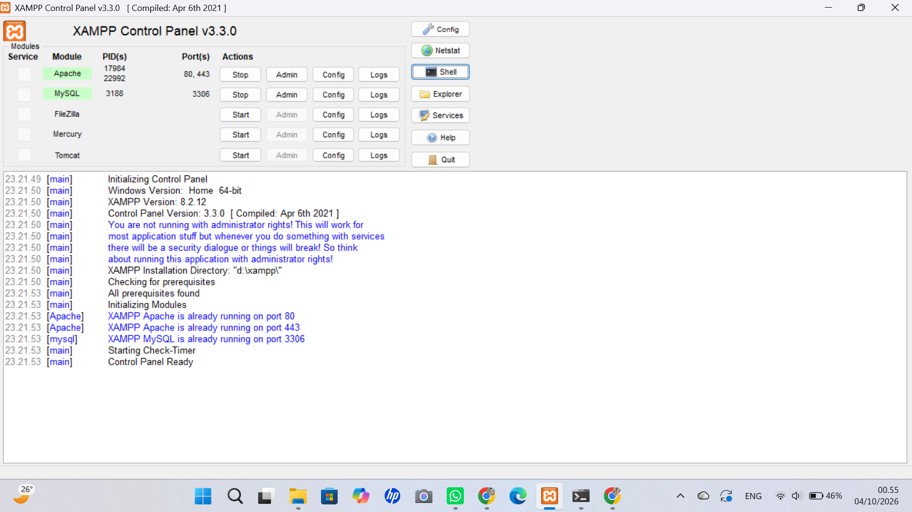

Pada Control Panel, baris MySQL berwarna hijau dengan PID 3188 dan port 3306. Apache juga menyala di port 80 dan 443. Di log muncul keterangan bahwa Apache dan MySQL sudah berjalan, karena layanan sudah saya nyalakan sebelum panel dibuka lagi. Log juga memberi peringatan bahwa panel tidak dijalankan sebagai administrator, tetapi layanan tetap berjalan normal. Jam sistem 00.55.

### D.2 Masuk lewat CLI sebagai root

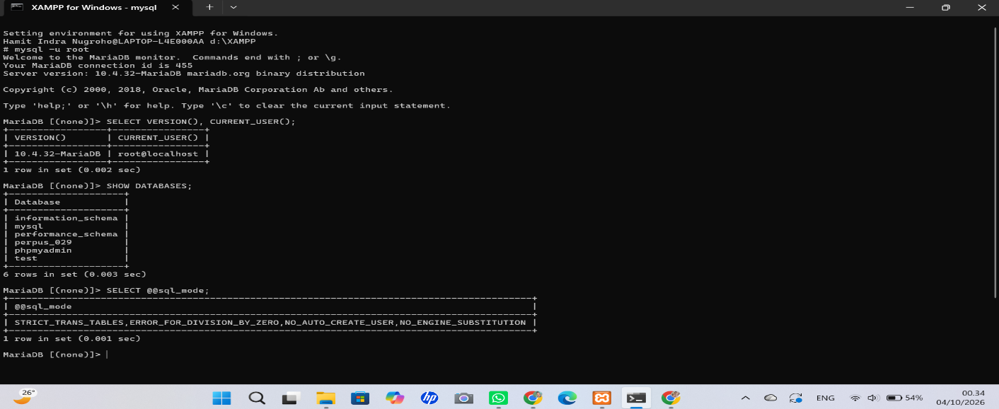

Saya membuka Shell dari Control Panel lalu masuk dengan `mysql -u root`. Hasil `SELECT VERSION(), CURRENT_USER();` adalah `10.4.32-MariaDB` dan `root@localhost`. `SHOW DATABASES;` menampilkan 6 basis data: `information_schema`, `mysql`, `performance_schema`, `perpus_029`, `phpmyadmin`, dan `test`. Hasil `SELECT @@sql_mode;` memuat `STRICT_TRANS_TABLES`, jadi mode ketat sudah aktif dan tidak perlu mengubah `my.ini`. Jam sistem 00.34.

### D.3 Mengamankan akun root

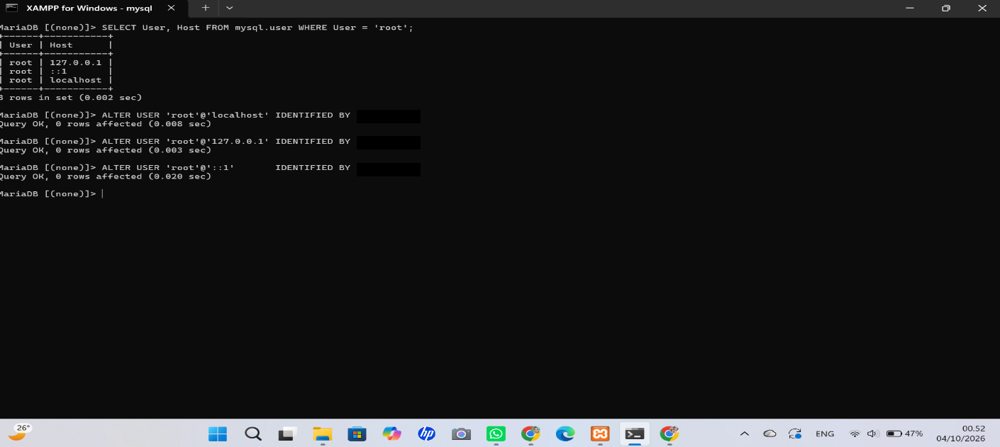

Kueri ke `mysql.user` menampilkan tiga akun root dengan host `127.0.0.1`, `::1`, dan `localhost`. Ketiganya saya beri password yang sama dengan `ALTER USER ... IDENTIFIED BY`, dan semuanya berhasil (`Query OK`). Jam sistem 00.52.

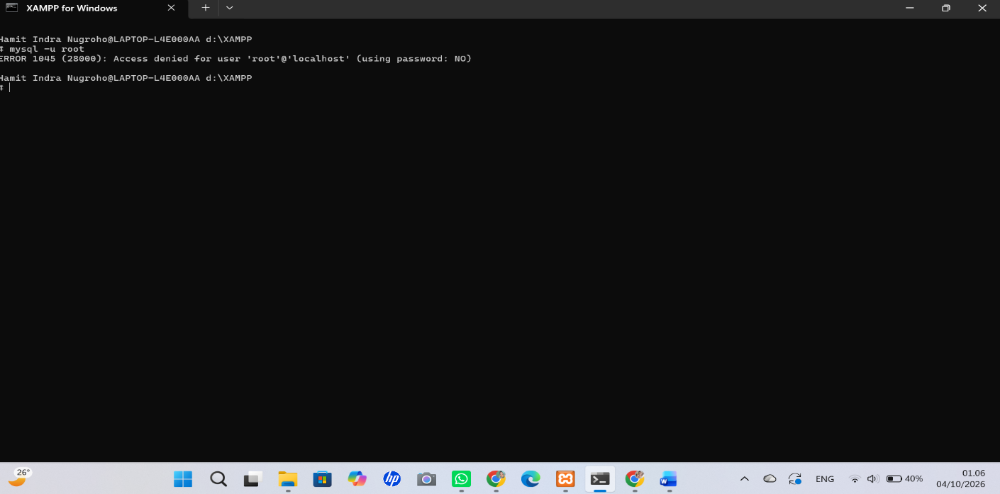

Setelah itu saya coba `mysql -u root` tanpa `-p`, dan hasilnya `ERROR 1045 (28000): Access denied for user 'root'@'localhost' (using password: NO)`. Jam sistem 01.06.

### D.4 Membuat basis data dan akun kerja

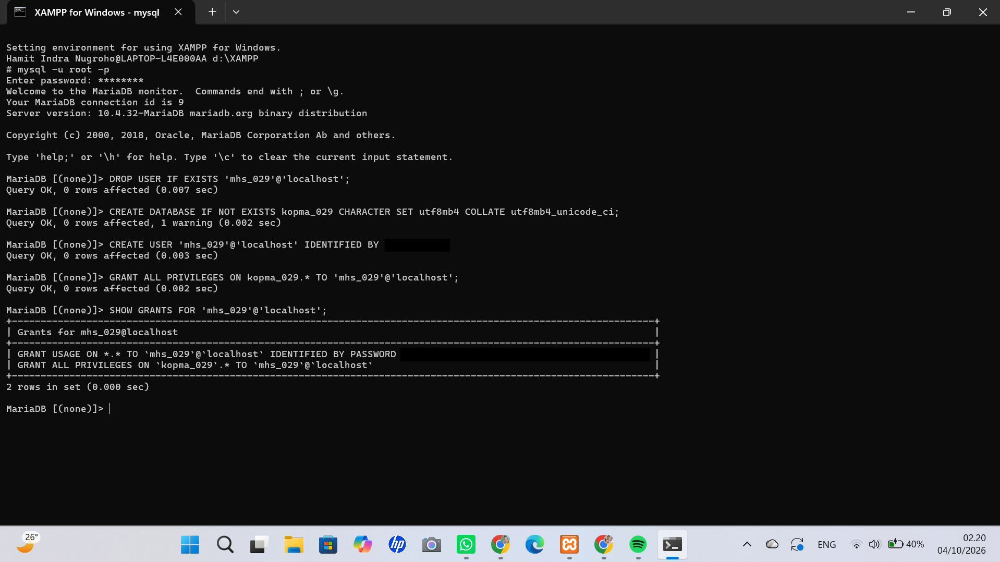

Saya masuk lagi dengan `mysql -u root -p`, lalu membuat basis data `kopma_029` (utf8mb4, `utf8mb4_unicode_ci`), membuat akun `mhs_029@localhost`, dan memberinya hak penuh khusus di `kopma_029.*`. `SHOW GRANTS` menampilkan dua baris: `USAGE` pada `*.*` dan `ALL PRIVILEGES` pada `kopma_029.*`. Jam sistem 02.20.

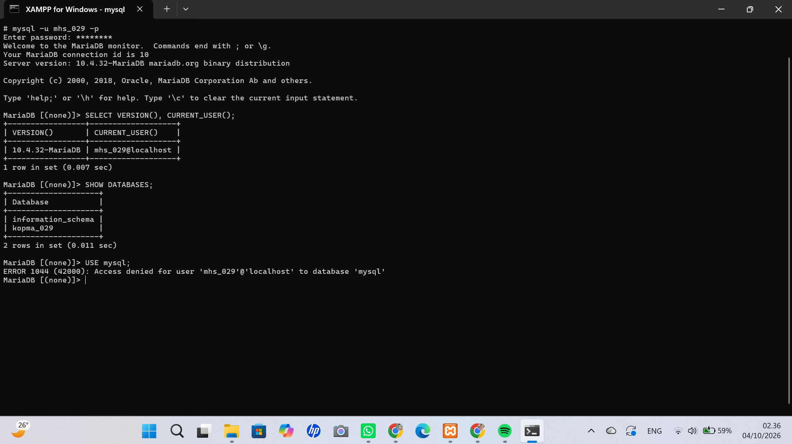

Dengan akun `mhs_029`, `CURRENT_USER()` bernilai `mhs_029@localhost`. `SHOW DATABASES` hanya menampilkan `information_schema` dan `kopma_029`. Saat saya jalankan `USE mysql;` server menjawab `ERROR 1044 (42000): Access denied for user 'mhs_029'@'localhost' to database 'mysql'`. Jam sistem 02.36.

### D.5 phpMyAdmin dengan mode cookie

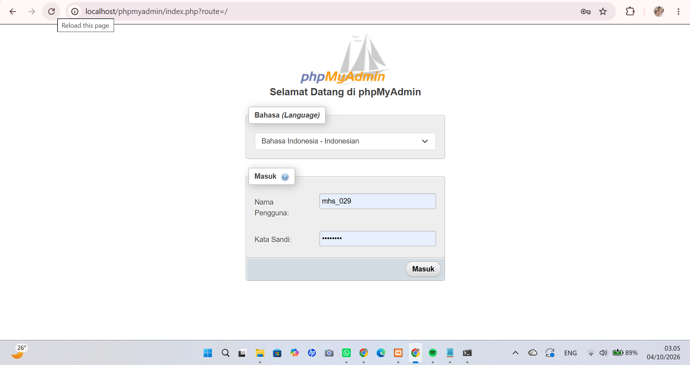

Setelah `auth_type` di `config.inc.php` saya ubah menjadi `'cookie'`, `http://localhost/phpmyadmin` menampilkan halaman masuk yang meminta nama pengguna dan kata sandi. Saya mengisi `mhs_029`. Jam sistem 03.05.

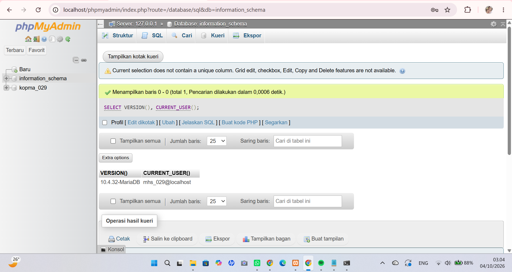

Setelah masuk, saya menjalankan `SELECT VERSION(), CURRENT_USER();` di tab SQL. Hasilnya sama dengan di CLI: `10.4.32-MariaDB` dan `mhs_029@localhost`. Panel kiri hanya menampilkan `information_schema` dan `kopma_029`. Peringatan kuning "Current selection does not contain a unique column" muncul karena hasil kuerinya bukan berasal dari tabel, jadi tidak ada masalah. Jam sistem 03.04.

### D.6 Repositori Git

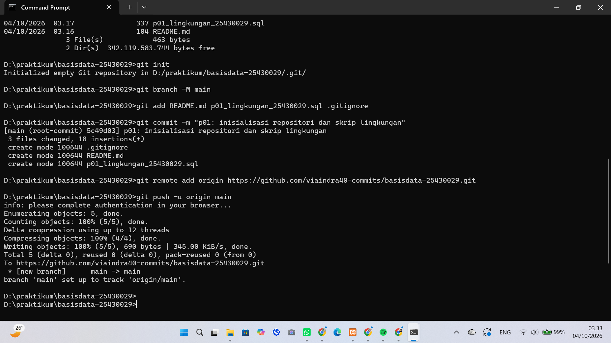

Di folder `D:\praktikum\basisdata-25430029` saya menjalankan `git init`, `git branch -M main`, `git add` untuk `README.md`, `p01_lingkungan_25430029.sql`, dan `.gitignore`, lalu `git commit -m "p01: inisialisasi repositori dan skrip lingkungan"`. Commit pertama berkode `5c49d03` dengan 3 berkas dan 18 baris. Setelah `git remote add origin ...` dan `git push -u origin main`, branch `main` terkirim ke GitHub dan terhubung ke `origin/main`. Jam sistem 03.33.

Isi skrip `p01_lingkungan_25430029.sql` (password diganti penanda):

```sql
-- p01_lingkungan_25430029.sql
-- Password sengaja diganti penanda. JANGAN commit password asli.
CREATE DATABASE IF NOT EXISTS kopma_029
  CHARACTER SET utf8mb4 COLLATE utf8mb4_unicode_ci;
CREATE USER IF NOT EXISTS 'mhs_029'@'localhost' IDENTIFIED BY '<password_kerja>';
GRANT ALL PRIVILEGES ON kopma_029.* TO 'mhs_029'@'localhost';
```

## 4. Jawaban Titik Analisis

**Titik Analisis 1 - Tombol "MySQL" padahal yang jalan MariaDB**

MariaDB itu cabang (fork) dari MySQL, jadi tombol di XAMPP masih memakai nama lama. Akibatnya, kalau saya mencari solusi galat di internet, jawaban yang muncul bisa saja ditulis untuk MySQL (terutama MySQL 8) dan tidak cocok dengan MariaDB 10.4 yang saya pakai. Di log pun tertulis `MariaDB monitor` dan versinya `10.4.32-MariaDB`, jadi itu yang harus saya jadikan acuan.

Dokumentasi MySQL masih bisa dipakai untuk hal-hal dasar yang sama di keduanya, misalnya sintaks `SELECT`, `INSERT`, `JOIN`, dan konsep dasar basis data. Untuk hal yang berhubungan dengan versi dan fitur khusus, saya harus membuka dokumentasi MariaDB, misalnya pengaturan akun dan autentikasi, nilai bawaan `sql_mode`, isi file `my.ini`, dan hal yang khusus MariaDB seperti mesin penyimpanan Aria serta tabel akun `mysql.global_priv`. Saat mencari, sebaiknya saya menambahkan kata "MariaDB 10.4" dan memeriksa versi yang dibahas.

**Titik Analisis 2 - Masuk tanpa `-p`**

Pesan yang muncul: `ERROR 1045 (28000): Access denied for user 'root'@'localhost' (using password: NO)` (lihat gambar di langkah D.3). Bagian yang menunjukkan klien tidak mengirim password adalah `using password: NO` di bagian akhir pesan. Artinya server menolak bukan karena password salah, tetapi karena memang tidak ada password yang dikirim. Kalau passwordnya salah, bagian itu akan berbunyi `using password: YES`. Perbaikannya cukup menambahkan `-p` pada perintah.

**Titik Analisis 3 - `information_schema` terlihat, `mysql` ditolak**

`information_schema` adalah basis data bawaan yang berisi informasi tentang objek-objek di server (metadata). Semua akun boleh melihatnya, tetapi isinya hanya menampilkan objek yang memang boleh diakses akun tersebut. Karena itu `mhs_029` tetap melihatnya. Basis data `mysql` adalah basis data sistem yang menyimpan data akun dan hak akses. `mhs_029` hanya diberi hak atas `kopma_029.*`, jadi `USE mysql;` ditolak dengan `ERROR 1044`.

Perbedaan kode galat:

- **1044** berarti sudah berhasil login, tetapi akun tidak punya hak pada basis data yang dituju (`Access denied ... to database`).
- **1045** berarti gagal login, biasanya karena password salah atau tidak dikirim.
- **1142** berarti sudah login dan sudah berada di basis data, tetapi perintah tertentu (misalnya `CREATE`) tidak diizinkan untuk objek atau tabel itu karena akun tidak punya hak tersebut.

**Titik Analisis 4 - Mode cookie lebih aman daripada config**

Pada mode `config`, nama pengguna dan password ditulis di `config.inc.php` dan phpMyAdmin langsung masuk sendiri tanpa menanyakan apa pun. Siapa saja yang bisa membuka `localhost/phpmyadmin` otomatis mendapat akses penuh sebagai root, dan password tersimpan sebagai teks biasa di berkas. Pada mode `cookie`, pengguna harus mengetik nama pengguna dan password tiap kali masuk, password tidak disimpan di berkas konfigurasi, dan hak akses yang didapat sesuai akun yang dipakai (misalnya `mhs_029` hanya melihat `kopma_029`).

## 5. Hasil Latihan dan Modifikasi

### Latihan 1 - Akun `tamu_029` (hanya SELECT)

Akun `tamu_029` saya buat dengan hak `SELECT` saja pada `kopma_029`:

```sql
CREATE USER 'tamu_029'@'localhost' IDENTIFIED BY '<password_tamu>';
GRANT SELECT ON kopma_029.* TO 'tamu_029'@'localhost';
```

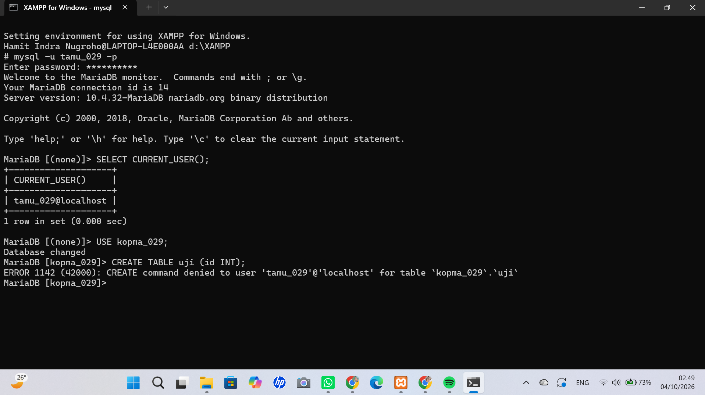

Setelah masuk sebagai `tamu_029`, perintah `USE kopma_029;` berhasil, tetapi `CREATE TABLE uji (id INT);` menghasilkan:

```
ERROR 1142 (42000): CREATE command denied to user 'tamu_029'@'localhost' for table `kopma_029`.`uji`
```

Artinya `tamu_029` boleh masuk dan membuka `kopma_029` karena punya hak `SELECT`, tetapi tidak punya hak `CREATE`, jadi server menolak perintah tersebut. Jam sistem 02.49.

### Latihan 2 - Skrip bisa dijalankan berulang

Skrip `p01_lingkungan_25430029.sql` saya ubah memakai `CREATE DATABASE IF NOT EXISTS` dan `CREATE USER IF NOT EXISTS` (isinya sama seperti yang ditampilkan di langkah D.6). Lalu skrip dijalankan dua kali dengan:

```
D:\XAMPP\mysql\bin\mysql.exe -u root -p < p01_lingkungan_25430029.sql
```

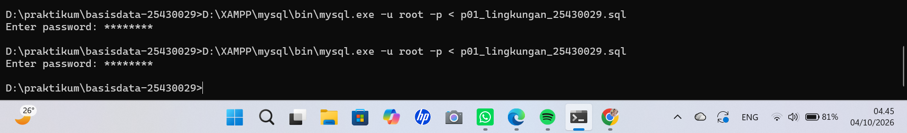

Kedua kali dijalankan tidak ada pesan galat. Tanpa `IF NOT EXISTS`, eksekusi kedua akan berhenti karena basis data dan akunnya sudah ada. Jam sistem 04.45.

## 6. Tugas Mandiri: Milestone Proyek 01


1. **Basis data proyek:** `perpus_029` (utf8mb4). Terlihat di daftar `SHOW DATABASES` pada gambar di bawah.
2. **Akun `dev_029`:** hanya berhak atas `perpus_029`.

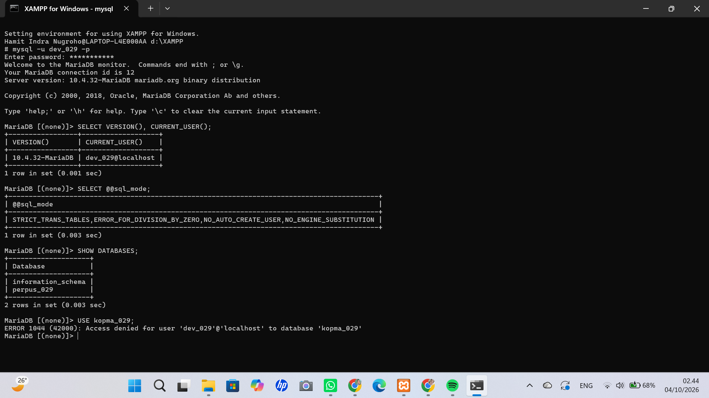

Dengan `dev_029`, `SHOW DATABASES` hanya menampilkan `information_schema` dan `perpus_029`. Mode SQL tetap ketat. Saat saya jalankan `USE kopma_029;`, hasilnya `ERROR 1044 (42000): Access denied for user 'dev_029'@'localhost' to database 'kopma_029'`. Jadi akun proyek terpisah dari akun praktikum. Jam sistem 02.44.

3. **README.md:** berisi nama, NIM, kelas, dan bagian Identitas Proyek. Tema: Perpustakaan (basis data `perpus_029`). Nama organisasi fiktif: Perpustakaan Cendekia HIN. Lingkup layanan: perpustakaan fiktif yang melayani pendaftaran anggota, pengelolaan katalog buku, peminjaman, pengembalian, dan penghitungan denda keterlambatan.
4. **.gitignore:** mengecualikan berkas yang berisi kredensial, yaitu `*.env` dan `kredensial*.txt`.
5. **Commit:** `p01: milestone proyek 1` sudah di-push ke GitHub (lihat bagian 10).

Keputusan desain: akun `dev_029` saya pisahkan dari `mhs_029` supaya proyek pribadi tidak bisa menyentuh basis data praktikum, dan sebaliknya. Dengan begitu kalau satu akun salah dipakai, kerusakannya terbatas. `.gitignore` saya buat sejak awal agar berkas password tidak ikut ter-commit tanpa sengaja.

## 7. Pembahasan dan Kendala

Hal yang paling terasa di pertemuan ini adalah membaca pesan galat. Tiga kode yang muncul punya penyebab berbeda: 1045 terjadi saat login (password tidak dikirim), 1044 terjadi saat mengakses basis data yang bukan hak akun, dan 1142 terjadi saat akun mencoba perintah yang tidak diizinkan. Dari ketiganya saya jadi paham bahwa kode galat memberi tahu di tahap mana penolakan terjadi.

**Kendala 1: MariaDB tidak mau menyala.** Tombol Start MySQL di Control Panel gagal. Ketika saya menjalankan `mysqld.exe --console` dari Command Prompt, log menampilkan `Aria recovery failed` dan `Cannot find checkpoint record at LSN`, lalu server berhenti dengan `Aborting`. Dugaan saya, MariaDB sebelumnya tidak ditutup dengan benar sehingga berkas log mesin Aria (`aria_log.*` dan `aria_log_control`) tidak cocok lagi dengan datanya. Saya mengganti nama berkas `aria_log_control` dan `aria_log.*` menjadi `.bak` (tidak saya hapus supaya masih bisa dikembalikan), lalu memperbaiki tabel sistem Aria seperti `db`, `tables_priv`, `columns_priv`, dan `proxies_priv` dengan `aria_chk -r`. Tabel `columns_priv` gagal pada percobaan pertama karena `aria_sort_buffer_size is too small`. Setelah saya ulangi dengan opsi `-o --sort_buffer_size=256M`, perbaikannya berhasil dan MariaDB bisa menyala.

**Kendala 2: password root dan akun `mhs_029` hilang.** Setelah MariaDB menyala, perintah `GRANT` sempat gagal dengan `ERROR 1030 ... Read page with wrong checksum ... from storage engine Aria`, tanda tabel akun masih bermasalah. Setelah itu login `root` dengan password yang sebelumnya saya pasang ditolak (`ERROR 1045`), sedangkan `mysql -u root` tanpa password malah berhasil, dan akun `mhs_029` tidak ada lagi (`ERROR 1133`). Dugaan saya, perubahan akun yang belum tertulis sempurna ke tabel Aria ikut hilang saat pemulihan, sehingga akun kembali ke kondisi awal XAMPP. Basis data `kopma_029` dan `perpus_029` ternyata masih ada. Saya memeriksa `CHECK TABLE mysql.global_priv` (hasilnya `OK` dengan satu peringatan soal ukuran indeks), memasang ulang password untuk ketiga akun root, lalu membuat ulang `mhs_029` beserta haknya.

**Kendala 3: salah nama pengguna di phpMyAdmin.** Login ditolak dengan `Access denied for user 'mhs_29'@'localhost'`. Ternyata saya mengetik `mhs_29`, kurang angka 0. Setelah saya ketik `mhs_029`, login berhasil. Server melaporkan persis nama yang diterimanya, jadi nama akun di pesan galat perlu dibaca teliti.

**Kendala 4: `git push` ditolak.** Saya mengubah isi README langsung lewat situs GitHub, sehingga GitHub punya satu commit yang tidak ada di komputer saya dan `git push` ditolak dengan `rejected ... fetch first`. Saya menjalankan `git fetch`, melihat commit tambahan dengan `git log` dan `git show`, lalu `git pull --rebase origin main`. Karena README berubah di dua tempat, muncul konflik. Saya tulis ulang README dengan isi yang benar, menjalankan `git add` dan `git rebase --continue`, lalu `git push`. Sekarang riwayat di komputer dan di GitHub sama. Pelajarannya, berkas sebaiknya diedit di komputer lalu di-push, bukan diedit di situs GitHub.

**Kendala 5: salah tempat mengetik perintah.** Saya sempat mengetik `mysql -u ... -p -h ...` di dalam prompt `MariaDB [(none)]>`, sehingga prompt berubah menjadi `->` dan tidak terjadi apa-apa. Perintah `mysql` dijalankan dari Command Prompt biasa, sedangkan di prompt MariaDB hanya perintah SQL yang diakhiri titik koma.

Beberapa hal kecil yang saya temui:

- **Peringatan administrator di XAMPP.** Log Control Panel memberi peringatan bahwa panel tidak berjalan sebagai administrator. Layanan tetap jalan karena saya hanya memakai Start/Stop dan Shell, tetapi untuk memasang atau mengubah service Windows mungkin perlu hak administrator.
- **Warning saat `CREATE DATABASE IF NOT EXISTS`.** Perintah itu menampilkan `1 warning` karena `kopma_029` sudah ada. Itu hanya pemberitahuan, bukan galat. Karena akun `mhs_029` pernah dibuat sebelumnya, saya menjalankan `DROP USER IF EXISTS` lebih dulu agar `CREATE USER` tidak bentrok.
- **Peringatan di phpMyAdmin.** Pesan "Current selection does not contain a unique column" muncul karena kueri `SELECT VERSION()` tidak mengambil data dari tabel. Hasilnya tetap benar.
- **Password pada tangkapan layar.** Pada perintah `ALTER USER` dan `CREATE USER`, password sempat terlihat sebagai teks. Karena repositori ini publik, bagian itu sudah saya tutup dengan kotak hitam, dan password akan saya ganti setelah praktikum selesai.

## 8. Kesimpulan

MariaDB di XAMPP berhasil dijalankan, akun root sudah diberi password, dan pekerjaan dipisahkan ke akun `mhs_029`, `dev_029`, dan `tamu_029` dengan hak yang berbeda-beda. Percobaan menunjukkan bahwa hak akses dibatasi sampai level basis data (galat 1044) dan level perintah (galat 1142). Skrip lingkungan juga sudah bisa dijalankan berulang dan seluruh pekerjaan tercatat di GitHub.

## 9. Pernyataan Penggunaan AI

Saya memakai Claude (Anthropic) sebagai asisten selama praktikum ini. Bantuannya mencakup: (1) memandu langkah praktikum dari buku praktikum, termasuk perintah SQL dan Git yang saya jalankan; (2) membantu membaca pesan galat dan memperbaikinya, yaitu kerusakan tabel Aria di MariaDB, hilangnya password root dan akun, serta konflik saat `git push`; (3) memeriksa tangkapan layar saya; dan (4) membantu menyusun dan merapikan laporan ini, termasuk draf bagian Pembahasan dan Kendala.

Yang saya kerjakan sendiri: menjalankan semua perintah di laptop saya, mengambil seluruh tangkapan layar, memilih password, mengurus akun GitHub dan repositori, serta memilih tema proyek. Semua jawaban dan draf dari AI saya baca ulang dan cocokkan dengan hasil percobaan saya sebelum dikumpulkan, dan saya siap menjelaskan isi laporan ini saat viva.

## 10. Bukti Git

- Repositori: https://github.com/viaindra40-commits/basisdata-25430029
- Commit pertama: `5c49d03` - `p01: inisialisasi repositori dan skrip lingkungan`
- Commit milestone: `a2d79ad` - `p01: milestone proyek 1`

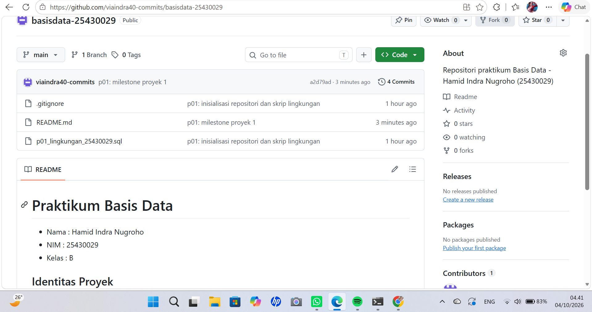

Halaman repositori menampilkan branch `main`, 4 commit, serta berkas `.gitignore`, `README.md`, dan `p01_lingkungan_25430029.sql`. README tampil dengan nama, NIM, dan kelas. Jam sistem 04.41.

## Checklist

**Checklist khusus Pertemuan 1**

- [x] Berkas wajib: `p01_lingkungan_25430029.sql` (dapat dijalankan ulang), `README.md` berisi Identitas Proyek, `.gitignore`
- [x] Bukti tangkapan layar: `SELECT VERSION(), CURRENT_USER();`, `SELECT @@sql_mode;`, `SHOW DATABASES` sebagai `mhs_029` dan `dev_029`; galat 1044 dan 1142; halaman masuk phpMyAdmin mode cookie; `git push` pertama
- [x] Analisis wajib: Titik Analisis 1-4; perbedaan kode galat 1044, 1045, dan 1142

**Checklist umum**

- [x] Identitas: nama, NIM, kelas, pertemuan ke-N, tanggal pelaksanaan, nama asisten/dosen
- [x] Tujuan ditulis dengan bahasa sendiri
- [x] Ringkasan teori maksimal setengah halaman
- [x] Langkah percobaan (D) dengan tangkapan layar dan keterangan
- [x] Titik Analisis dijawab dengan alasan
- [x] Latihan (E) dengan bukti berjalan
- [x] Tugas Mandiri (F): berkas, bukti, dan keputusan desain
- [x] Pembahasan dan kendala
- [x] Kesimpulan
- [x] Pernyataan Penggunaan AI
- [x] Bukti Git (tautan dan hash commit)
- [x] Keaslian: tangkapan layar menampilkan jam sistem; nama objek memuat NIM
